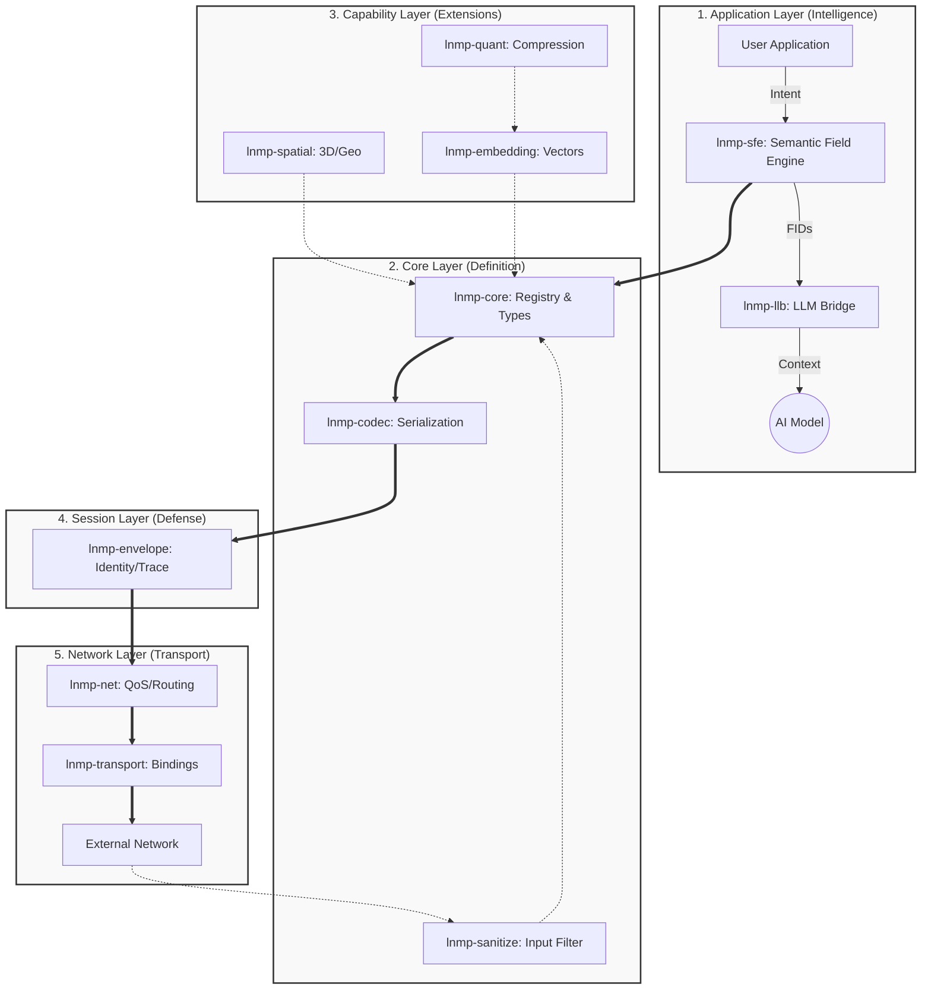
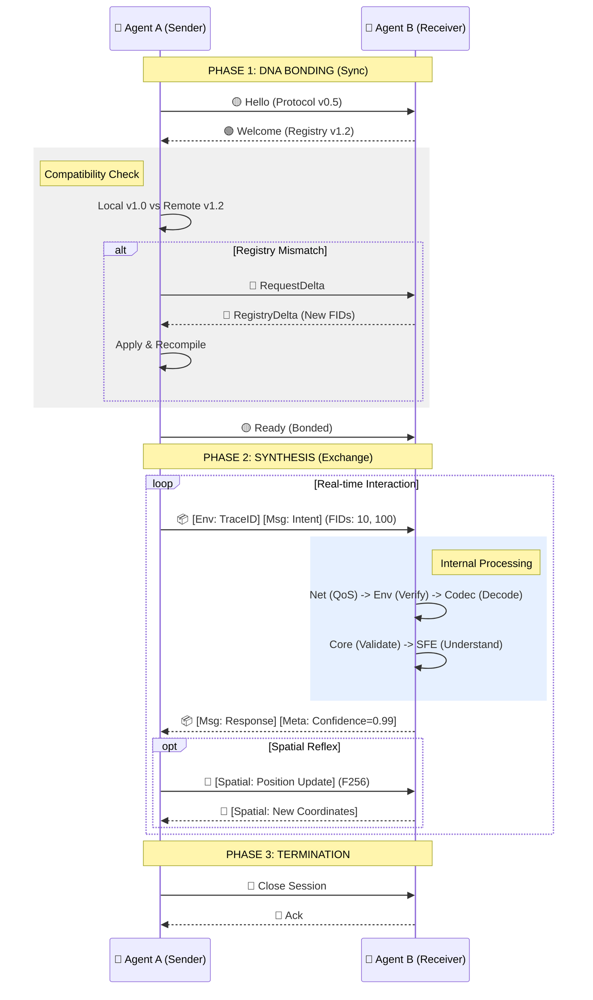

# LNMP Protocol Architecture (v0.5.14)

This document defines the structural architecture of the LNMP protocol, mapping the **12 ecosystem crates** into a unified layered model.

## 1. The Protocol Stack (The Centipede)

The LNMP architecture is composed of 5 vertical layers. Each layer has a specific responsibility and communicates only with adjacent layers.

### Module Responsibilities

| Layer | Module | Responsibility |
| :--- | :--- | :--- |
| **1. App** | `lnmp-sfe` | **Translator:** Converts human intent/concepts into Protocol FIDs. |
| | `lnmp-llb` | **Optimizer:** Formats data for LLM context windows (ShortForm). |
| **2. Core** | `lnmp-core` | **Authority:** Holds the FID Registry and Type Definitions. |
| | `lnmp-codec` | **Encoder:** Handles Binary/Text serialization. |
| | `lnmp-sanitize` | **Filter:** Cleans "dirty" input before strict parsing. |
| **3. Cap** | `lnmp-spatial` | **Sense:** Provides coordinate systems and spatial math. |
| | `lnmp-embedding` | **Memory:** Manages high-dimensional vector data. |
| | `lnmp-quant` | **Efficiency:** Compresses vectors (up to 32x) for transport. |
| **4. Def** | `lnmp-envelope` | **Identity:** Signs packets, adds Trace IDs and Timestamps. |
| **5. Net** | `lnmp-net` | **Router:** Classifies messages (Alert/Log) and assigns QoS. |
| | `lnmp-transport` | **Binding:** Maps LNMP concepts to HTTP/Kafka/gRPC. |

---

## 2. The Data Flow (The DNA Helix)

This sequence illustrates the lifecycle of a message, showing how two agents sync ("Bonding") and exchange data ("Synthesis").

