# LNMP Architecture & Flow: The Digital Organism

This document illustrates the LNMP protocol as a living biological system. It visualizes how the **12-module ecosystem** functions together to create intelligent, evolving agent communication.

## 1. The Anatomy of LNMP (Module Map)

Each crate in the ecosystem serves a critical physiological function.

```mermaid
graph TD
    %% ZONE 1: CORTEX (Cognition)
    subgraph "The Cortex (Cognition)"
        App[Application]
        SFE[lnmp-sfe: Semantic Engine]
        LLB[lnmp-llb: Language Center]
        
        App -->|Intent| SFE
        SFE -->|FIDs| LLB
        LLB -->|Tokens| LLM((LLM))
    end

    %% ZONE 2: NUCLEUS (Genetics)
    subgraph "The Nucleus (DNA)"
        Core[lnmp-core: Registry & Types]
        Codec[lnmp-codec: Transcription]
    end

    %% ZONE 3: IMMUNE SYSTEM (Defense)
    subgraph "Immune System"
        San[lnmp-sanitize: Hygiene]
        Env[lnmp-envelope: Identity/Wall]
    end

    %% ZONE 4: PHYSIOLOGY (Senses)
    subgraph "Physiology (Body)"
        Spatial[lnmp-spatial: Proprioception]
        Emb[lnmp-embedding: Memory]
        Quant[lnmp-quant: Metabolism]
    end

    %% ZONE 5: CIRCULATION (Transport)
    subgraph "Circulatory System"
        Net[lnmp-net: Autonomic NS]
        Trans[lnmp-transport: Vascular]
        Ext[External World]
    end

    %% Data Flow Spine
    SFE ==>|Maps| Core
    Core ==>|Defines| Codec
    Codec ==>|Packets| Env
    Env ==>|Sealed| Net
    Net ==>|Routed| Trans
    Trans ==>|Flow| Ext

    %% Input Filter
    Ext -.->|Raw| San
    San -.->|Clean| Codec

    %% Capability Extensions (Lateral Connections)
    Spatial -.->|Extends| Core
    Emb -.->|Extends| Core
    Quant -.->|Optimizes| Emb

    %% Style
    linkStyle default stroke-width:2px,fill:none,stroke:#333;
```

### 🫀 Organ Systems Defined

*   **The Cortex (`sfe`, `llb`):** The brain. Translates abstract Intent into Protocol genetics (FIDs) and optimizes language for the LLM.
*   **The Nucleus (`core`, `codec`):** The DNA. Stores the immutable Registry and transcribes data into binary RNA.
*   **Immune System (`envelope`, `sanitize`):** Protects the cell. Filters toxins (malformed input) and asserts Identity/Traceability.
*   **Physiology (`spatial`, `embedding`, `quant`):** The body. Provides senses (Space), memory (Vectors), and metabolic efficiency (Quantization).
*   **Circulation (`net`, `transport`):** The blood flow. Manages priorities (QoS) and physical movement (HTTP/Kafka).

---

## 2. The Connectivity DNA Helix (E2E Flow)

This sequence diagram illustrates the "Double Helix" interaction between two agents. The strands are connected by protocol bonds.

```mermaid
sequenceDiagram
    participant A as 🧬 Agent A
    participant B as 🧬 Agent B
    
    Note over A,B: Phase 1: Recognition (Discovery)
    
    A->>B: 🟡 Hello (Protocol v0.5)
    B-->>A: 🟢 Welcome (Registry v1.2)
    
    rect rgb(20, 30, 40)
        Note left of A: DNA Bonding: Schema Alignment
        A->>A: Check Registry Sync
        alt Registry Mismatch
            A->>B: 🔴 RequestDelta(v1.0 -> v1.2)
            B-->>A: 🔵 RegistryDelta (New FIDs)
            A->>A: Apply Delta & Compile
        end
    end
    
    A->>B: 🟡 Ready (Bond Established)
    
    Note over A,B: Phase 2: Synthesis (Data Exchange)
    
    loop Stream / Bi-Directional
        A->>B: 📦 [Env: TraceID] [Msg: Prompt] (FIDs: 10, 768)
        
        rect rgb(40, 50, 60)
            Note right of B: Semantic Processing
            B->>B: Env.Verify() -> Codec.Decode() -> SFE.Understand()
        end
        
        B-->>A: 📦 [Msg: Response] [Meta: Complexity=0.9]
        
        opt Spatial Context
            A->>B: 🧊 [Spatial: Position] (F256)
            B-->>A: 🧊 [Spatial: New Coordinates]
        end
    end
    
    Note over A,B: Phase 3: Termination
    
    A->>B: 🔴 Close Session
    B-->>A: 🔴 Ack
```



## 3. The "Centipede" Topology (Multi-Agent Harmony)

LNMP allows multiple agents to connect like segments of a giant organism.


