# LNMP Architecture & Flow: The Digital Organism

This document provides a comprehensive, end-to-end visualization of the LNMP protocol. It maps the technical modules to "biological" systems to illustrate how LNMP functions not just as a data format, but as a living language for AI agents.

## 1. The Anatomy of LNMP (Module Map)

Each crate in the ecosystem serves a critical physiological function in the digital organism.

### 🧬 Structural Meaning
*   **lnmp-core (The DNA):** The immutable truths. FIDs (Field IDs) are the genetic codons (A, C, G, T) that define meaning efficiently.
*   **lnmp-sfe (The Brain):** Translates abstract "thoughts" (User Intent) into genetic instructions (FIDs).
*   **lnmp-envelope (The Cell Wall):** Protects the payload. Contains the Identity (Source), Timestamp, and Trace ID. It ensures the "cell" is distinct and traceable.
*   **lnmp-quant (Metabolism):** Optimizes energy usage by compressing heavy vector data (Embeddings) up to 32x, allowing the organism to "think" faster and lighter.
*   **lnmp-spatial (Proprioception):** Gives the agent a sense of "self" in physical or virtual space.

---

## 2. The Cycle of Life: E2E Data Flow

This diagram illustrates the complete journey of a "Thought" becoming an "Action" across the network.

### Stage A: Conception (Intent Formation)
*   **Source:** Agent A wants to say *"Move to coordinates (10, 20) quickly."*
*   **SFE:** Maps concepts -> FIDs: `Action=Move`, `Pos=[10,20]`, `Urgency=High`.

### Stage B: DNA Transcription (Encoding)
*   **Core:** Validates values against the Registry (e.g., `Pos` must be `:fa` FloatArray).
*   **Codec:** Transcribes these values into compact Binary LNMP (The "RNA" strand).

### Stage C: Cellular Transport (Encapsulation)
*   **Envelope:** Wraps the Binary payload. Adds headers: `Source: AgentA`, `TraceID: xyz-123`, `Time: 1734438000`.
*   **Net:** Transmits the envelope over the wire (Bloodstream).

### Stage D: Reception & Perception
*   **Agent B** receives the pulse.
*   **Envelope:** Verifies Identity (Source). "This is safe."
*   **Codec:** Decodes binary back to structured data.
*   **SFE:** "Feeling" the data. Resolves FIDs back to concepts.
*   **Spatial:** Updates internal world model. "Agent A is moving."

```mermaid
sequenceDiagram
    participant Mind as 🧠 Agent Mind
    participant SFE as 🔮 SFE (Translator)
    participant Core as 🧬 Core/Codec
    participant Env as 🛡️ Envelope
    participant Net as 📡 Network

    %% Sending
    Note over Mind, Net: 1. OUTBOUND FLOW (Expression)
    Mind->>SFE: Intent: "Move(10, 20)"
    SFE->>Core: Lookup FIDs (Move=100, x=256...)
    Core->>Core: Validate Types (:fa, :s)
    Core->>Env: Payload (Binary DNA)
    Env->>Env: Seal (Add Trace/Source)
    Env->>Net: Dispatch (Packet)

    %% Network Transit
    Net-->>Net: ⚡ Transmission ⚡

    %% Receiving
    Note over Mind, Net: 2. INBOUND FLOW (Perception)
    Net->>Env: Receive (Packet)
    Env->>Env: Verify Identity
    Env->>Core: Unwrap Payload
    Core->>SFE: Decode DNA to FIDs
    SFE->>Mind: Semantic Concept: "Target Moving"
    
    opt Spatial Reflex
        Mind->>Mind: Update Spatial Index
    end
```

---

## 3. The "Centipede" Topology (Multi-Agent Harmony)

LNMP allows multiple modules to connect like segments of a centipede, moving in unison.

*   **Synchronization:** Unlike strict APIs (Rest/JSON), LNMP agents share a "genetic link" (The Registry). If the Registry evolves (new FIDs), all agents evolve their understanding instantly without breaking the connection.
*   **M2M (Machine-to-Machine):** High-speed, low-latency binary stream.
*   **A2A (Agent-to-Agent):** High-context, semantic meaning exchange.

## 4. Why This Structure?

1.  **Semantic Density:** By separating the *definition* (Registry) from the *transmission* (Binary), we achieve maximum information density. We don't send keys like `"temperature"`, we send `768`.
2.  **Evolutionary Safety:** Old agents ignore new FIDs (Junk DNA), while new agents utilize them. This allows the system to evolve organically without "breaking changes".
3.  **Universal Grounding:** Through `lnmp-spatial` and `lnmp-core`, all agents agree on fundamental truths (Time, Space, Identity), preventing hallucinations in multi-agent collaboration.
