# LNMP Architecture & Flow Visualization

This document visualizes the "DNA-like" structure of the LNMP protocol, showing how Semantic Field Engine (SFE), Registry, Codec, and Transport layers synchronize to enable Agent-to-Agent (A2A) and Model-to-Model (M2M) communication.

## The LNMP Centipede (Protocol Stack)

The protocol operates like a biological organism where each segment has a specific function, connected by a central nervous system (The Core).

## The Connectivity DNA Helix (E2E Flow)

This sequence diagram illustrates the "Double Helix" interaction between two agents. The strands are connected by protocol bonds (Negotiation, Sync, Data).

```mermaid
sequenceDiagram
    participant A as Agent A (Client)
    participant B as Agent B (Service)
    
    Note over A,B: Phase 1: Recognition (Discovery & Handshake)
    
    A->>B: 🟡 Hello (Protocol v0.5)
    B-->>A: 🟢 Welcome (Capabilities + Registry v1.2)
    
    rect rgb(20, 20, 30)
        Note left of A: DNA Bonding: Schema Alignment
        A->>A: Check Registry Sync
        alt Registry Mismatch
            A->>B: 🔴 RequestRegistryDelta(v1.0 -> v1.2)
            B-->>A: 🔵 RegistryDelta (New FIDs defined)
            A->>A: Apply Delta & Compile
        end
    end
    
    A->>B: 🟡 Ready (Schema Negotiated)
    
    Note over A,B: Phase 2: Synthesis (Data Exchange)
    
    loop Stream / Bi-Directional
        A->>B: 📦 [Msg: Prompt] + [Ctx: Temperature=0.7] (FIDs: 10, 768)
        
        rect rgb(40, 40, 50)
            Note right of B: Semantic Processing
            B->>B: Decode -> Resolve FIDs -> Inference
        end
        
        B-->>A: 📦 [Msg: Response] + [Meta: Complexity=0.9] (FIDs: 11, 41)
        
        opt Spatial Context (Multimodal)
            A->>B: 🧊 [Spatial: Position + Vector] (F256, F512)
            B-->>A: 🧊 [Spatial: New Coordinates]
        end
    end
    
    Note over A,B: Phase 3: Termination
    
    A->>B: 🔴 Close Session
    B-->>A: 🔴 Ack
```

## Module Interactions (The Organism)

How the Rust crates interact internally to produce the "Life Logic".

