# LNMP Architecture & Flow: The Digital Organism

This document illustrates the LNMP protocol (v0.5.14) as a highly structured biological system. It combines a clean, layered anatomical view with a detailed physiological flow.

## 1. The Anatomy (Layered Architecture)

The protocol is organized into distinct functional layers, ensuring separation of concerns and modular efficiency.

```mermaid
graph TD
    %% LAYER 1: COGNITION (The Brain)
    subgraph Layer1 ["🧠 1. COGNITIVE LAYER (Cortex)"]
        direction TB
        App[Application]
        SFE[lnmp-sfe: Semantic Engine]
        LLB[lnmp-llb: Language Bridge]
        LLM((LLM Model))
        
        App <--> SFE
        SFE <--> LLB
        LLB <--> LLM
    end

    %% LAYER 2: CORE (The DNA)
    subgraph Layer2 ["🧬 2. CORE LAYER (Nucleus)"]
        direction TB
        LnmpCore[lnmp-core: Registry]
        Codec[lnmp-codec: Transcription]
    end

    %% LAYER 3: CAPABILITIES (Physiology)
    subgraph Layer3 ["💪 3. CAPABILITY LAYER (Body)"]
        direction LR
        Spatial[lnmp-spatial]
        Emb[lnmp-embedding]
        Quant[lnmp-quant]
        
        Spatial --- Emb
        Emb --- Quant
    end

    %% LAYER 4: DEFENSE (Immune System)
    subgraph Layer4 ["🛡️ 4. DEFENSE LAYER (Immunity)"]
        direction TB
        San[lnmp-sanitize: Hygiene]
        Env[lnmp-envelope: Identity]
    end

    %% LAYER 5: TRANSPORT (Circulation)
    subgraph Layer5 ["📡 5. TRANSPORT LAYER (Vascular)"]
        direction TB
        Net[lnmp-net: Routing/QoS]
        Trans[lnmp-transport: Bindings]
    end

    %% MAIN SPINE (Vertical Integration)
    %% Node-to-Node connections drive the layout, no need for Layer-to-Layer links
    SFE ==> LnmpCore
    
    LnmpCore ==> Codec
    Codec ==> Env
    Env ==> Net
    Net ==> Trans

    %% CONNECTION REFINEMENTS
    App --> SFE
    SFE --> LLB
    LLB --> LLM
    
    %% Capability Connections
    LnmpCore -.-> Spatial
    LnmpCore -.-> Emb
    Emb -.-> Quant

    %% Defense / Transport Connections
    San -.-> LnmpCore
    Ext -.-> San
    Trans -.-> Ext

    %% STYLING
    %% STYLING
    style Layer1 fill:#e3f2fd,stroke:#1565c0,stroke-width:2px
    style Layer2 fill:#fff8e1,stroke:#fbc02d,stroke-width:2px
    style Layer3 fill:#e8f5e9,stroke:#2e7d32,stroke-width:2px
    style Layer4 fill:#ffebee,stroke:#c62828,stroke-width:2px
    style Layer5 fill:#f3e5f5,stroke:#7b1fa2,stroke-width:2px
```

### 🧬 Guide to Layers

1.  **Cognitive Layer:** Where "meaning" happens. `lnmp-sfe` translates intent to FIDs; `lnmp-llb` compresses text for the LLM.
2.  **Core Layer:** The source of truth. `lnmp-core` holds the Registry; `lnmp-codec` handles binary encoding.
3.  **Capability Layer:** Extends the core with superpowers. `spatial` (Location), `embedding` (Memory), `quant` (Efficiency).
4.  **Defense Layer:** Protects the organism. `lnmp-sanitize` cleans input; `lnmp-envelope` signs and wraps packets.
5.  **Transport Layer:** Moves the data. `lnmp-net` prioritizes traffic; `lnmp-transport` binds to HTTP/Kafka.

---

## 2. The Cycle of Life (DNA Helix Flow)

How a message comes alive and travels between agents.

```mermaid
sequenceDiagram
    participant A as 🧬 Agent A
    participant B as 🧬 Agent B
    
    Note over A,B: PHASE 1: RECOGNITION (Handshake)
    
    A->>B: 🟡 Hello (Protocol v0.5)
    B-->>A: 🟢 Welcome (Registry v1.2)
    
    rect rgb(20, 30, 40)
        Note left of A: DNA Bonding
        A->>A: Registry Mismatch?
        opt Sync Required
            A->>B: 🔴 RequestDelta
            B-->>A: 🔵 RegistryDelta
            A->>A: Apply & Compile
        end
    end
    
    A->>B: 🟡 Bond Established
    
    Note over A,B: PHASE 2: SYNTHESIS (Data Exchange)
    
    loop Stream Interaction
        A->>B: 📦 [Env: TraceID] [Msg: Action] (FIDs: 10, 100)
        
        rect rgb(40, 50, 60)
            Note right of B: Processing
            B->>B: Verify -> Decode -> Understand -> Act
        end
        
        B-->>A: 📦 [Msg: Result] [Meta: Status=OK]
        
        opt Spatial Reflex (Multimodal)
            A->>B: 🧊 [Spatial: Vector] (F256)
            B-->>A: 🧊 [Spatial: Update]
        end
    end
    
    Note over A,B: PHASE 3: TERMINATION
    
    A->>B: 🔴 Close Session
    B-->>A: 🔴 Ack
```

