# LNMP Architecture & Flow: The Digital Organism

This document provides a comprehensive, end-to-end visualization of the LNMP protocol (v0.5.14). It maps the **complete 12-crate ecosystem** to biological systems, illustrating how the protocol functions as a living, breathing language for AI agents.

## 1. The Anatomy of LNMP (Module Map)

Every single module plays a vital role in the physiology of the digital organism.

### 🫀 Organ Systems Defined

1.  **The Cortex (Cognition):**
    *   **`lnmp-sfe` (Semantic Field Engine):** "Broca's Area". Translates abstract thought (Intent) into protocol language (FIDs).
    *   **`lnmp-llb` (LLM Bridge):** "Language Center". Optimizes data for the LLM brain (ShortForm/Explain Mode), saving cognitive energy (tokens).

2.  **The Nucleus (Genetics):**
    *   **`lnmp-core`:** "DNA". The immutable Registry and Base Types.
    *   **`lnmp-codec`:** "RNA Polymerase". Transcribes DNA into transmissible binary strands.

3.  **Physiology (Capabilities):**
    *   **`lnmp-spatial`:** "Proprioception". Allows the agent to sense itself in 3D/Geo space.
    *   **`lnmp-embedding`:** "Hippocampus". Long-term vector memory structure.
    *   **`lnmp-quant`:** "Metabolism". Compresses heavy vector data (32x) for efficiency.

4.  **Immune System (Defense):**
    *   **`lnmp-envelope`:** "Cell Wall". Defines Identity, Traceability, and protects the payload.
    *   **`lnmp-sanitize`:** "Liver/Kidneys". Filters and fixes toxic (malformed) input before it reaches the core.

5.  **Circulation (Transport):**
    *   **`lnmp-net`:** "Autonomic Nervous System". Decides *how* to route signals (QoS, Priority) based on meaning.
    *   **`lnmp-transport`:** "Vascular System". The physical bindings (HTTP headers, Kafka metadata) that carry the blood.

---

## 2. The Cycle of Life: E2E Data Flow

The complete journey of a message within the organism.

```mermaid
sequenceDiagram
    participant Mind as 🧠 Mind/LLM
    participant SFE as 🔮 SFE
    participant Core as 🧬 Core
    participant Env as 🛡️ Env
    participant Net as 📡 Net

    %% OUTBOUND
    rect rgb(240, 248, 255)
    Note over Mind, Net: 1. OUTBOUND (Expression)
    Mind->>SFE: Intent: "Alert"
    SFE->>Core: Map FIDs
    Core->>Env: Binary Payload
    Env->>Net: Encapsulate
    Net->>Net: Route (QoS)
    end

    %% INBOUND
    rect rgb(255, 248, 240)
    Note over Mind, Net: 2. INBOUND (Perception)
    Net->>Env: Receive
    Env->>Core: Verify & Unwrap
    Core->>SFE: Decode
    SFE->>Mind: Semantic Concept
    end
```

## 3. Why Every Module Matters

*   **Without `lnmp-sanitize`**, the organism is vulnerable to "poison" (malformed data) crashing the Core.
*   **Without `lnmp-llb`**, the "Brain" (LLM) overflows with verbose data (Context Window Exhaustion).
*   **Without `lnmp-net`**, the system has "high blood pressure" (network congestion) because it treats all data as equal, blocking critical reflexes with mundane logs.
*   **Without `lnmp-quant`**, the "Memory" (Vectors) becomes too heavy to move, paralyzing the agent.

This architecture ensures **Safety, Efficiency, and Intelligence** at every layer.
