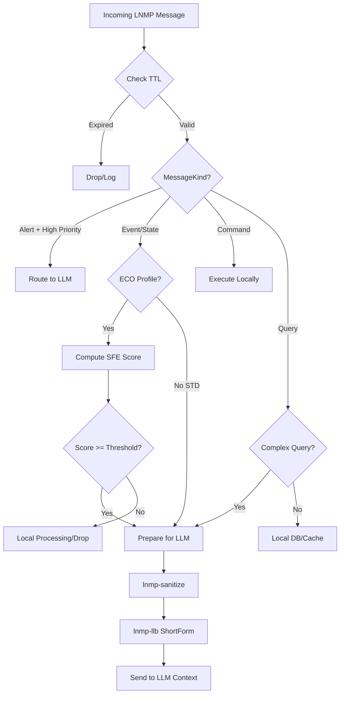

# LNMP-Net v1.0 Specification

**Status**: Draft  
**Version**: 1.0  
**Date**: 2024-11-25  
**Authors**: LNMP Protocol Team

---

## Table of Contents

1. [Scope & Motivation](#1-scope--motivation)
2. [Core Concepts](#2-core-concepts)
3. [Canonical Message Structure](#3-canonical-message-structure)
4. [MessageKind Definition](#4-messagekind-definition)
5. [QoS and ECO Fields](#5-qos-and-eco-fields)
6. [Profiles](#6-profiles)
7. [Transport Binding Rules](#7-transport-binding-rules)
8. [LLM Integration Rules](#8-llm-integration-rules)
9. [Security & Observability](#9-security--observability)
10. [Browser/UI Gateway Pattern](#10-browserui-gateway-pattern)
11. [Node Configuration & Deployment](#11-node-configuration--deployment)

---

## 1. Scope & Motivation

### 1.1 Purpose

**LNMP-Net** is a standardized message profile for LLM and agent networks built on the LNMP ecosystem. It provides:

- **Standard message semantics** for agent-to-agent, LLM-to-LLM, and machine-to-machine (M2M) communication
- **Network behavior standardization** for continuously running, energy/token-conscious decision systems
- **Quality of Service (QoS)** primitives for message routing, prioritization, and lifecycle management

### 1.2 What LNMP-Net Is NOT

LNMP-Net is **not**:

- ❌ A new binary serialization format
- ❌ A replacement for TCP/IP or transport protocols
- ❌ A standalone messaging system

### 1.3 Foundation Layers

LNMP-Net builds on top of existing LNMP modules:

```
┌─────────────────────────────────────┐
│         LNMP-Net Layer              │  ← MessageKind, Priority, TTL, Class
├─────────────────────────────────────┤
│  lnmp-llb  │  lnmp-sfe  │ lnmp-san │  ← LLM Bridge, SFE Scoring, Sanitize
├─────────────────────────────────────┤
│         lnmp-envelope               │  ← Timestamp, Source, TraceID, Seq
├─────────────────────────────────────┤
│         lnmp-core                   │  ← LnmpRecord (data itself)
├─────────────────────────────────────┤
│         lnmp-transport              │  ← HTTP, Kafka, gRPC, NATS bindings
└─────────────────────────────────────┘
```

### 1.4 Use Cases

- **Multi-agent systems**: Robots, autonomous vehicles, distributed AI agents
- **LLM orchestration**: Routing data to appropriate LLMs based on importance/freshness
- **Edge + Cloud hybrid**: Deciding what to process locally vs. send to cloud LLMs
- **Real-time critical systems**: Health monitoring, safety alerts, autonomous systems
- **Token/energy optimization**: Reducing LLM API calls through intelligent filtering

---

## 2. Core Concepts

### 2.1 LNMP Node

**Definition**: Any process that produces and/or consumes LNMP messages.

**Characteristics**:
- Has a unique `node_id` / `source` identifier
- Connected to one or more transport backends (HTTP, Kafka, NATS, gRPC)
- May optionally integrate LLM capabilities (via lnmp-llb)

### 2.2 LNMP Message

**Definition**: An LNMP Record + Envelope + LNMP-Net metadata.

**Components**:
1. **Record** (lnmp-core): The actual data payload
2. **Envelope** (lnmp-envelope): Operational metadata (timestamp, source, trace_id, sequence)
3. **Net Metadata** (LNMP-Net): Network behavior metadata (kind, priority, ttl, class)

### 2.3 Transport

LNMP-Net is transport-agnostic. Supported transports include:

- **HTTP** / **REST**: Request-response patterns
- **gRPC**: Bidirectional streaming
- **Kafka**: Pub-sub event streaming
- **NATS**: Lightweight messaging
- **Future**: QUIC, UDP, custom real-time protocols

---

## 3. Canonical Message Structure

### 3.1 Logical Model

```
┌─────────────────────────────────────────┐
│          LNMP Message                   │
├─────────────────────────────────────────┤
│  Record (LnmpRecord)                    │
│    - Payload data (LNMP format)         │
├─────────────────────────────────────────┤
│  Envelope (LnmpEnvelope)                │
│    - timestamp: u64 (epoch ms)          │
│    - source: String (node_id)           │
│    - trace_id: String                   │
│    - sequence: u64                      │
│    - (optional) tenant: String          │
│    - (optional) user_id: String         │
├─────────────────────────────────────────┤
│  Net Metadata (LNMP-Net Layer)          │
│    - kind: MessageKind                  │
│    - priority: u8 (0-255)               │
│    - ttl_ms: u32                        │
│    - class: Option<String>              │
└─────────────────────────────────────────┘
```

### 3.2 Pseudo-Type Definition

```rust
// Conceptual type - not exact implementation
struct LnmpMessage {
    // From lnmp-core
    record: LnmpRecord,
    
    // From lnmp-envelope
    envelope: LnmpEnvelope {
        timestamp: u64,      // epoch milliseconds
        source: String,      // node identifier
        trace_id: String,    // correlation/tracing ID
        sequence: u64,       // monotonic sequence number
        tenant: Option<String>,
        user_id: Option<String>,
    },
    
    // LNMP-Net layer
    kind: MessageKind,
    priority: u8,            // 0-255
    ttl_ms: u32,             // time-to-live in milliseconds
    class: Option<String>,   // domain classification
}
```

---

## 4. MessageKind Definition

### 4.1 Standard Message Types

```rust
enum MessageKind {
    Event,      // Sensor data, telemetry, system events
    State,      // Component/system state snapshots
    Command,    // Imperative actions ("do this")
    Query,      // Information requests ("give me data")
    Alert,      // Critical health/safety/security warnings
}
```

### 4.2 Semantic Descriptions

#### Event
- **Purpose**: Asynchronous notifications of something that happened
- **Examples**: 
  - Sensor readings (temperature, GPS coordinates)
  - User actions (button clicked, form submitted)
  - System events (service started, connection established)
- **LLM Routing**: Medium priority for LLM processing
  - High volume → use SFE scoring to filter
  - Recent + important events → send to LLM
  - Old/low-importance → drop or log only
- **Edge Handling**: Most events can be processed locally; only anomalies or aggregated insights need cloud/LLM

#### State
- **Purpose**: Snapshots of system/component current condition
- **Examples**:
  - Robot position and orientation
  - Service health status
  - Database connection pool metrics
- **LLM Routing**: Low-to-medium priority
  - State changes → potentially important
  - Periodic heartbeats → usually local processing only
- **Edge Handling**: Local state monitoring with exception-based escalation

#### Command
- **Purpose**: Directive to perform an action
- **Examples**:
  - "Start motor X"
  - "Deploy model version Y"
  - "Invalidate cache Z"
- **LLM Routing**: Usually **NOT** sent to LLM
  - LLM may *generate* commands
  - Execution happens at edge/service level
  - Logging/audit may go to analytics
- **Edge Handling**: Direct execution at target node; ACK/NACK response expected

#### Query
- **Purpose**: Request for information
- **Examples**:
  - "What is current temperature?"
  - "List active connections"
  - "Retrieve user profile"
- **LLM Routing**: Depends on query complexity
  - Simple queries → local DB/cache
  - Complex/semantic queries → may benefit from LLM reasoning
- **Edge Handling**: Most queries resolved locally; escalate to LLM for interpretation/synthesis

#### Alert
- **Purpose**: Urgent, safety-critical, or security-critical notifications
- **Examples**:
  - Health monitor: "Heart rate anomaly detected"
  - Safety system: "Collision warning"
  - Security: "Unauthorized access attempt"
- **LLM Routing**: **HIGHEST PRIORITY**
  - Always processed, never dropped
  - Should reach policy engine or LLM for decision support
  - Immediate action required
- **Edge Handling**: Alert path must be guaranteed; redundant delivery acceptable

### 4.3 Routing Decision Matrix

| MessageKind | Priority Range | TTL Range      | LLM Routing          | Edge Processing      |
|-------------|----------------|----------------|----------------------|----------------------|
| Event       | 0-200          | 1s-60s         | Via SFE filtering    | Aggregate, anomalies |
| State       | 0-150          | 5s-300s        | On change only       | Local monitoring     |
| Command     | 100-200        | 100ms-5s       | Rarely (audit only)  | Direct execution     |
| Query       | 50-200         | 100ms-10s      | Complex queries only | Local DB/cache first |
| Alert       | 201-255        | 0-5s           | Always               | Immediate escalation |

---

## 5. QoS and ECO Fields

### 5.1 Priority Field

**Type**: `u8` (0-255)

**Ranges**:
- **0-50**: Low priority (logs, analytics, background tasks)
- **51-200**: Normal priority (business logic, standard operations)
- **201-255**: Critical priority (health, safety, alerts)

**Behavior Guidelines**:
- Nodes should process higher priority messages first
- Transport layers may use priority for queue ordering
- In resource-constrained scenarios, low-priority messages may be dropped

### 5.2 TTL (Time-To-Live)

**Type**: `u32` (milliseconds)

**Purpose**: Define message freshness window

**Ranges**:
- **0-5000ms**: Real-time data (sensor readings, live metrics)
- **5000-60000ms**: Near real-time (events, state changes)
- **60000ms+**: Durable data (logs, analytics, historical records)

**Behavior Guidelines**:
- **Expired messages** (`current_time - timestamp > ttl_ms`):
  - May be dropped at any processing stage
  - Should be logged if in audit/debug mode
  - Never sent to LLM (wasteful)
- **TTL = 0**: Special case
  - Indicates "no expiry" or "process once immediately"
  - Use with caution; prefer explicit TTL values

### 5.3 Class Field

**Type**: `Option<String>` (optional domain tag)

**Purpose**: Domain-specific classification for routing/filtering

**Examples**:
- `"health"` - Health monitoring data
- `"safety"` - Safety-critical systems
- `"traffic"` - Traffic/navigation data
- `"finance"` - Financial transactions
- `"generic"` - Uncategorized

**Usage**:
- Enables domain-aware routing rules
- Allows specialized LLM models per domain
- Facilitates compliance/audit requirements

### 5.4 ECO (Energy/Token Optimization) Logic

**Goal**: Minimize LLM API calls and energy consumption while maintaining decision quality.

**Decision Function**:
```python
def should_send_to_llm(msg, now_ms, config):
    # 1. Check expiry
    if now_ms - msg.envelope.timestamp > msg.ttl_ms:
        return False  # Expired, drop
    
    # 2. Always send alerts
    if msg.kind == "Alert" and msg.priority > 200:
        return True
    
    # 3. Commands and Queries: rarely send to LLM
    if msg.kind in ["Command", "Query"]:
        return False  # Local processing
    
    # 4. Events and State: use SFE + priority scoring
    sfe_score = compute_sfe_score(msg, now_ms)
    base_importance = (msg.priority / 255.0) * 0.5 + sfe_score * 0.5
    
    return base_importance >= config.llm_threshold
```

**Benefits**:
- 10-100x reduction in LLM API calls
- Lower latency for edge-processed messages
- Reduced token costs
- Energy savings for edge devices

---

## 6. Profiles

LNMP-Net defines three operational profiles:

### 6.1 STD (Standard) Profile

**Target**: General-purpose applications, development, prototyping

**Characteristics**:
- All transport types supported (HTTP, Kafka, NATS, gRPC)
- Text and binary LNMP formats allowed
- No strict message filtering
- Flexible priority/TTL handling

**Use Cases**:
- Development and testing
- Internal enterprise applications
- Non-time-critical systems

### 6.2 ECO (Energy/Token Optimization) Profile

**Target**: Production LLM-integrated systems with cost/energy constraints

**Characteristics**:
- **SFE integration**: All messages scored for freshness + importance
- **Priority + TTL filtering**: Aggressive dropping of low-value messages
- **LLM gating**: Only high-importance messages reach LLM
- **Class-based routing**: Domain-specific LLM models

**Decision Logic**:
```
For each message:
  1. Check expiry (ttl_ms)
  2. Compute SFE score (importance + freshness)
  3. Combine with priority: weighted_score = priority * 0.5 + sfe * 0.5
  4. if weighted_score >= threshold: route to LLM
  5. else: local processing or drop
```

**Benefits**:
- 90%+ reduction in LLM token consumption
- Lower operational costs
- Faster response times (most messages processed locally)

**Use Cases**:
- Production LLM applications
- Mobile/edge devices with battery constraints
- High-volume IoT systems

### 6.3 RT (Real-Time) Profile

**Status**: Future / Experimental

**Target**: Ultra-low-latency, safety-critical systems

**Characteristics**:
- **Binary-only**: No text format (too slow)
- **Fixed header size**: Predictable parsing time
- **Minimal payload**: LNMP Quant, spatial deltas, etc.
- **Transport**: QUIC, UDP, custom real-time protocols
- **Priority enforcement**: Hardware-level QoS if available

**Design Principles** (implementation TBD):
- Sub-millisecond message handling
- Deterministic latency bounds
- Lossy transport acceptable (UDP)
- Redundant delivery for alerts

**Use Cases** (future):
- Autonomous vehicles
- Industrial robotics
- Medical devices
- Aerospace systems

---

## 7. Transport Binding Rules

### 7.1 General Principles

1. **LNMP Record** → Transport payload/body (binary or text)
2. **Envelope + Net Metadata** → Transport headers/metadata
3. **Standard header names**: Consistent across transports

### 7.2 HTTP / REST

**Mapping**:

| LNMP Field         | HTTP Header              | Example Value           |
|--------------------|--------------------------|-------------------------|
| `kind`             | `X-LNMP-Kind`            | `Event`, `Alert`        |
| `priority`         | `X-LNMP-Priority`        | `150`                   |
| `ttl_ms`           | `X-LNMP-TTL`             | `5000`                  |
| `class`            | `X-LNMP-Class`           | `health`                |
| `timestamp`        | `X-LNMP-Timestamp`       | `1700000000000`         |
| `source`           | `X-LNMP-Source`          | `node-42`               |
| `trace_id`         | `X-LNMP-Trace-ID`        | `abc123xyz`             |
| `sequence`         | `X-LNMP-Sequence`        | `1024`                  |

**Body**: LNMP Record (binary or text)

**Example**:
```http
POST /lnmp/ingest HTTP/1.1
Host: api.example.com
Content-Type: application/octet-stream
X-LNMP-Kind: Alert
X-LNMP-Priority: 255
X-LNMP-TTL: 1000
X-LNMP-Class: safety
X-LNMP-Timestamp: 1700000000000
X-LNMP-Source: robot-alpha
X-LNMP-Trace-ID: trace-9876
X-LNMP-Sequence: 42

[LNMP binary payload]
```

### 7.3 gRPC

**Mapping**: Use gRPC metadata (key-value pairs)

| LNMP Field  | gRPC Metadata Key    |
|-------------|----------------------|
| `kind`      | `lnmp-kind`          |
| `priority`  | `lnmp-priority`      |
| `ttl_ms`    | `lnmp-ttl`           |
| `class`     | `lnmp-class`         |
| `timestamp` | `lnmp-timestamp`     |
| `source`    | `lnmp-source`        |
| `trace_id`  | `lnmp-trace-id`      |
| `sequence`  | `lnmp-sequence`      |

**Message**: LNMP Record in protobuf `bytes` field

### 7.4 Kafka

**Mapping**:

| LNMP Field  | Kafka Header Key    |
|-------------|---------------------|
| `kind`      | `lnmp.kind`         |
| `priority`  | `lnmp.priority`     |
| `ttl_ms`    | `lnmp.ttl`          |
| `class`     | `lnmp.class`        |
| `timestamp` | `lnmp.timestamp`    |
| `source`    | `lnmp.source`       |
| `trace_id`  | `lnmp.trace_id`     |
| `sequence`  | `lnmp.sequence`     |

**Value**: LNMP Record (binary)

**Topic Naming**: 
- Recommended: `lnmp.{class}.{kind}` (e.g., `lnmp.health.alert`, `lnmp.traffic.event`)
- Enables filtering via Kafka consumer group subscriptions

### 7.5 NATS

**Mapping**:

| LNMP Field  | NATS Header Key     |
|-------------|---------------------|
| `kind`      | `lnmp-kind`         |
| `priority`  | `lnmp-priority`     |
| `ttl_ms`    | `lnmp-ttl`          |
| `class`     | `lnmp-class`        |
| `timestamp` | `lnmp-timestamp`    |
| `source`    | `lnmp-source`       |
| `trace_id`  | `lnmp-trace-id`     |
| `sequence`  | `lnmp-sequence`     |

**Payload**: LNMP Record (binary)

**Subject Naming**:
- Recommended: `lnmp.{class}.{kind}` (e.g., `lnmp.safety.alert`, `lnmp.generic.event`)
- Hierarchical subscription: `lnmp.safety.*` or `lnmp.*.alert`

---

## 8. LLM Integration Rules

### 8.1 Decision Flow



### 8.2 Priority Rules

1. **Alert messages** with `priority > 200`:
   - Always route to LLM or policy engine
   - Bypass SFE scoring
   - Guaranteed delivery

2. **Event/State messages**:
   - In ECO profile: Apply SFE scoring + priority weighting
   - In STD profile: May send all, depending on config

3. **Command messages**:
   - Rarely sent to LLM (execution is local)
   - May log to audit/analytics stream

4. **Query messages**:
   - Simple queries: Local resolution
   - Complex/semantic queries: LLM assistance

### 8.3 Integration with lnmp-sfe and lnmp-llb

**Step-by-step processing**:

```python
# 1. Receive message
msg = receive_lnmp_message()

# 2. Check expiry
if is_expired(msg, now_ms):
    log_and_drop(msg)
    return

# 3. Compute importance (lnmp-sfe)
sfe_score = compute_sfe_score(msg, now_ms)  # freshness + importance
base_importance = (msg.priority / 255.0) * 0.5 + sfe_score * 0.5

# 4. Routing decision
if msg.kind == "Alert" and msg.priority > 200:
    send_to_llm = True
elif msg.kind in ["Event", "State"]:
    send_to_llm = base_importance >= config.llm_threshold
else:
    send_to_llm = False  # Command/Query handled locally

# 5. If sending to LLM
if send_to_llm:
    # a. Sanitize (lnmp-sanitize)
    sanitized = sanitize_for_llm(msg)
    
    # b. Convert to ShortForm (lnmp-llb)
    compact_text = to_short_form(sanitized)
    
    # c. Add to LLM context
    llm_context.append(compact_text)
```

### 8.4 Token Optimization

**Metrics**:
- **Before ECO**: 100,000 messages/day → 100,000 LLM API calls
- **After ECO**: 100,000 messages/day → 1,000-10,000 LLM API calls (90-99% reduction)

**Strategies**:
1. **Aggressive TTL enforcement**: Stale data never reaches LLM
2. **SFE filtering**: Only fresh + important data
3. **Class-based specialization**: Route health → health-LLM, traffic → traffic-LLM
4. **ShortForm compression**: Reduce token count per message

---

## 9. Security & Observability

### 9.1 Transport Security

**Requirements**:

1. **TLS/mTLS mandatory** for all production deployments
   - HTTP/gRPC: TLS 1.2+ required, TLS 1.3 recommended
   - Kafka: TLS + SASL/SCRAM or mTLS
   - NATS: TLS + user/pass or token authentication

2. **Authentication**:
   - Node-to-node: Mutual TLS (mTLS) preferred
   - API clients: OAuth 2.0, API keys, or JWT tokens
   - Kafka/NATS: ACLs for topic/subject access control

3. **Authorization**:
   - Envelope `source` field used for identity verification
   - Optional `tenant`, `user_id` for multi-tenancy
   - Policy engine (e.g., Open Policy Agent) for fine-grained access control

### 9.2 Data Integrity

**Semantic Checksum** (from lnmp-core):
- Lightweight integrity verification
- Detects corruption during transport
- **Not** cryptographic security (use TLS for that)

**Future: Digital Signatures** (lnmp-sign module, planned):
- Canonical LNMP + Envelope → compute hash → sign with private key
- Receivers verify with public key
- Non-repudiation for critical messages (alerts, commands)

### 9.3 Observability

**Tracing**:
- `trace_id` in Envelope enables distributed tracing
- Integrate with OpenTelemetry, Jaeger, Zipkin
- Trace message flow: node A → transport → node B → LLM → response

**Logging**:
- Log all dropped messages (expired, low-priority) for analytics
- Log LLM routing decisions (sent/not sent, reasoning)
- Structured logs with `trace_id`, `source`, `kind`, `priority`

**Metrics**:
- Messages per second (by kind, priority, class)
- Drop rate (expired, low-priority)
- LLM routing rate (ECO efficiency)
- Latency (end-to-end, per transport)

**Example Metrics**:
```
lnmp_messages_total{kind="Event", priority="low"} 50000
lnmp_messages_dropped{reason="expired"} 5000
lnmp_llm_routed{class="health"} 200
lnmp_latency_ms{transport="kafka", p99="50"}
```

---

## 10. Browser/UI Gateway Pattern

### 10.1 Principle

> **Browsers do NOT need to understand LNMP.**  
> Gateway nodes handle JSON ↔ LNMP-Net translation.

### 10.2 Architecture

```
┌─────────────┐      JSON/REST       ┌──────────────┐
│   Browser   │ ←──────────────────→ │   Gateway    │
│  (React,    │   WebSocket/HTTP     │   Node       │
│   Vue, etc) │                      │ (LNMP-aware) │
└─────────────┘                      └──────────────┘
                                            ↕
                                      LNMP-Net Protocol
                                            ↕
                  ┌──────────────────────────────────────┐
                  │  Backend Nodes (LNMP-Net native)     │
                  │  - Service A (Kafka)                 │
                  │  - Service B (NATS)                  │
                  │  - LLM Node (HTTP)                   │
                  └──────────────────────────────────────┘
```

### 10.3 Gateway Responsibilities

**Inbound** (Browser → Backend):
1. Receive JSON request from browser
2. Create `LnmpRecord` from JSON payload
3. Create `LnmpEnvelope`:
   - `timestamp`: current time
   - `source`: gateway node ID
   - `trace_id`: generate or extract from request header
   - `sequence`: increment counter
4. Create LNMP-Net metadata:
   - `kind`: from JSON field or URL path (e.g., `/events` → `Event`)
   - `priority`: from JSON or default
   - `ttl_ms`: from JSON or default
   - `class`: from JSON or infer from context
5. Publish to backend transport (Kafka topic, NATS subject, etc.)

**Outbound** (Backend → Browser):
1. Subscribe to relevant LNMP-Net messages (via Kafka, NATS, etc.)
2. Receive LNMP message
3. Check TTL (drop if expired)
4. Convert `LnmpRecord` → JSON
5. Add metadata as JSON fields (kind, priority, timestamp, etc.)
6. Push to browser via WebSocket or SSE (Server-Sent Events)

### 10.4 Example JSON ↔ LNMP Mapping

**Browser sends**:
```json
{
  "type": "query",
  "priority": 100,
  "ttl_ms": 5000,
  "class": "health",
  "data": {
    "user_id": "usr_123",
    "metric": "heart_rate",
    "duration": "1h"
  }
}
```

**Gateway creates LNMP message**:
```rust
LnmpMessage {
    record: LnmpRecord::from_json(&data),
    envelope: LnmpEnvelope {
        timestamp: 1700000000000,
        source: "gateway-01",
        trace_id: "trace-xyz",
        sequence: 1024,
        ...
    },
    kind: MessageKind::Query,
    priority: 100,
    ttl_ms: 5000,
    class: Some("health".to_string()),
}
```

**Backend responds** → Gateway converts back to JSON → Browser receives:
```json
{
  "type": "state",
  "priority": 50,
  "timestamp": 1700000001000,
  "source": "health-service",
  "data": {
    "heart_rate": 72,
    "unit": "bpm",
    "status": "normal"
  }
}
```

---

## 11. Node Configuration & Deployment

### 11.1 LNMP Node Perspective

**Definition**: Every LNMP application is a "Node" from LNMP-Net's perspective.

**Node** = A service that produces and/or consumes LNMP messages.

### 11.2 Core Configuration Parameters

```yaml
node:
  id: "robot-alpha-01"               # Unique node identifier
  source: "robot-alpha-01"           # Same as id, used in Envelope
  
transport:
  backends:
    - type: kafka
      brokers: ["kafka1:9092", "kafka2:9092"]
      topics:
        subscribe: ["lnmp.safety.alert", "lnmp.traffic.event"]
        publish: ["lnmp.health.state"]
    - type: nats
      url: "nats://nats.example.com:4222"
      subjects:
        subscribe: ["lnmp.commands.>"]
        publish: ["lnmp.events.robot"]
    - type: http
      endpoint: "https://api.example.com/lnmp/ingest"
  
llm:
  enabled: true                      # Enable LLM integration
  profile: "ECO"                     # STD, ECO, or RT
  threshold: 0.7                     # SFE score threshold for LLM routing
  
  modules:
    - lnmp-sfe                       # Freshness + importance scoring
    - lnmp-llb                       # ShortForm compression
    - lnmp-sanitize                  # LLM I/O safety
  
  provider:
    type: "openai"                   # or "anthropic", "local", etc.
    model: "gpt-4"
    api_key_env: "OPENAI_API_KEY"

security:
  tls:
    enabled: true
    cert: "/path/to/cert.pem"
    key: "/path/to/key.pem"
  authentication:
    type: "mtls"                     # or "api_key", "oauth2"
```

### 11.3 Node Deployment Diagram

```
┌─────────────────────────────────────────┐
│         LNMP Node (Service)             │
├─────────────────────────────────────────┤
│  Application Logic                      │
├─────────────────────────────────────────┤
│  LNMP Modules:                          │
│    - lnmp-core        (data)            │
│    - lnmp-envelope    (metadata)        │
│    - lnmp-net         (routing logic)   │
│    - lnmp-transport   (HTTP/Kafka/NATS) │
│                                         │
│  Optional LLM Modules:                  │
│    - lnmp-sfe         (scoring)         │
│    - lnmp-llb         (ShortForm)       │
│    - lnmp-sanitize    (safety)          │
├─────────────────────────────────────────┤
│  Transport Connections:                 │
│    ← Kafka Consumer (lnmp.safety.*)     │
│    → Kafka Producer (lnmp.health.state) │
│    ← NATS Subscriber (lnmp.commands.>)  │
│    → HTTP Client (POST to LLM API)      │
└─────────────────────────────────────────┘
```

### 11.4 Multi-Node System Example

**Scenario**: Autonomous robot fleet with central monitoring

```
┌──────────────┐  Event (GPS, speed)     ┌─────────────┐
│  Robot A     │ ──────────────────────→ │   Kafka     │
│ (LNMP Node)  │                         │  (lnmp.*)   │
└──────────────┘                         └─────────────┘
                                               ↓
┌──────────────┐  State (battery, temp)       ↓
│  Robot B     │ ──────────────────────→      ↓
│ (LNMP Node)  │                              ↓
└──────────────┘                              ↓
                                               ↓
                  ┌────────────────────────────┘
                  ↓
         ┌─────────────────┐
         │  Monitor Node   │  Alert (anomaly detected)
         │  (LLM Enabled)  │ ───────────────────────────→ Operator Dashboard
         │  - lnmp-sfe     │
         │  - lnmp-llb     │  Command (change route)
         │  - LLM API      │ ────────────────────────────→ Robot A
         └─────────────────┘
```

**Flow**:
1. Robots A & B produce **Event** and **State** messages → publish to Kafka
2. Monitor Node subscribes to `lnmp.fleet.event` and `lnmp.fleet.state`
3. Monitor Node uses **ECO profile**:
   - Most events: processed locally (low SFE score)
   - Anomalies: sent to LLM for analysis (high SFE score)
4. LLM detects issue → Monitor Node publishes **Alert** (priority 255) → Operator Dashboard
5. Operator sends **Command** via Dashboard → Gateway → Kafka → Robot A

---

## 12. Future Work

### 12.1 Real-Time (RT) Profile Implementation

- Binary-only LNMP codec optimization
- QUIC/UDP transport bindings
- Sub-millisecond latency benchmarks
- Deterministic QoS mechanisms

### 12.2 Digital Signatures (lnmp-sign)

- Canonical LNMP hashing
- Ed25519 / ECDSA signature schemes
- Public key infrastructure (PKI)
- Non-repudiation for critical messages

### 12.3 Advanced SFE Policies

- Per-class SFE models (health vs. traffic)
- Adaptive thresholds based on system load
- Reinforcement learning for optimal routing

### 12.4 Multi-Tenant Isolation

- Envelope `tenant` field enforcement
- Per-tenant LLM quotas
- Isolation guarantees in shared infrastructure

---

## 13. Conclusion

LNMP-Net provides a **thin, powerful abstraction** for LLM and agent networks:

- ✅ **Semantic message types** (Event/State/Command/Query/Alert)
- ✅ **QoS primitives** (priority, TTL)
- ✅ **Energy/token optimization** (ECO profile)
- ✅ **Transport-agnostic** (HTTP, Kafka, NATS, gRPC)
- ✅ **LLM integration** (SFE + LLB + sanitize)
- ✅ **Security & observability** (TLS, tracing, metrics)

By building on existing LNMP modules, LNMP-Net enables **intelligent, cost-effective, scalable agent networks** without reinventing serialization or transport layers.

---

**Next Steps**: See [LNMP-Net Implementation Roadmap](#roadmap) for phased development plan.

## Appendix A: Roadmap

### Phase 1 - Specification (1-2 days) ✅
- ✅ This document

### Phase 2 - lnmp-net Crate (~1 week)
- Create `crates/lnmp-net`
- Implement `MessageKind` enum
- Implement `NetMessage` wrapper
- Helper functions: `is_expired`, `base_importance`, `should_send_to_llm`
- Unit tests

### Phase 3 - Transport Integration (~1 week)
- HTTP header mapping
- Kafka header mapping
- NATS header mapping
- gRPC metadata mapping
- Example: 2-node basic communication

### Phase 4 - Documentation & Examples (~1 week)
- `crates/lnmp-net/examples/basic.rs`
- Update `lnmp` meta crate README
- "LNMP-Net & LLM" integration guide
- Multi-agent scenario walkthrough
